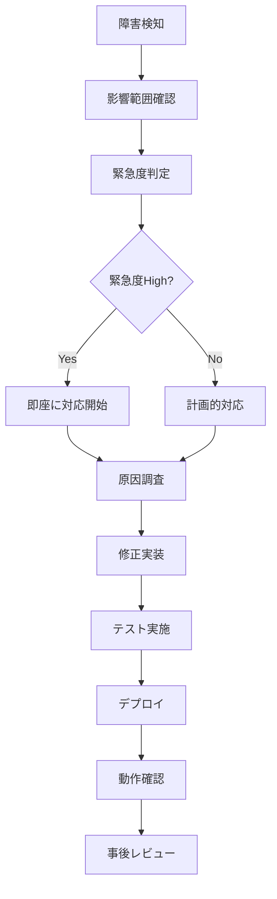

# デプロイメント・運用ガイド

## 概要

Stream Aggregator の本番環境デプロイと運用に関するガイドです。Vercel、AWS、Docker環境での展開方法と監視・メンテナンス手順を記載しています。

## デプロイメント戦略

### 1. Vercel デプロイ（推奨）

#### 環境設定
```bash
# Vercel CLI インストール
npm i -g vercel

# プロジェクト初期化
vercel init

# 環境変数設定
vercel env add TWITCH_CLIENT_ID
vercel env add TWITCH_CLIENT_SECRET
vercel env add YOUTUBE_CLIENT_ID
vercel env add YOUTUBE_CLIENT_SECRET
vercel env add NEXTAUTH_URL
vercel env add NEXT_PUBLIC_API_URL
```

#### vercel.json 設定
```json
{
  "framework": "nextjs",
  "regions": ["nrt1"],
  "functions": {
    "app/api/**/*.ts": {
      "maxDuration": 30
    }
  },
  "env": {
    "NODE_ENV": "production"
  },
  "build": {
    "env": {
      "NEXT_TELEMETRY_DISABLED": "1"
    }
  }
}
```

### 2. Docker デプロイ

#### Dockerfile
```dockerfile
FROM node:18-alpine AS base

# 依存関係のインストール
FROM base AS deps
RUN apk add --no-cache libc6-compat
WORKDIR /app
COPY package.json package-lock.json ./
RUN npm ci --only=production

# ソースコードのビルド
FROM base AS builder
WORKDIR /app
COPY --from=deps /app/node_modules ./node_modules
COPY . .
RUN npm run build

# 本番イメージ
FROM base AS runner
WORKDIR /app

ENV NODE_ENV production

RUN addgroup --system --gid 1001 nodejs
RUN adduser --system --uid 1001 nextjs

COPY --from=builder /app/public ./public
COPY --from=builder --chown=nextjs:nodejs /app/.next/standalone ./
COPY --from=builder --chown=nextjs:nodejs /app/.next/static ./.next/static

USER nextjs

EXPOSE 3000

ENV PORT 3000
ENV HOSTNAME "0.0.0.0"

CMD ["node", "server.js"]
```

#### docker-compose.yml
```yaml
version: '3.8'
services:
  app:
    build: .
    ports:
      - "3000:3000"
    environment:
      - NODE_ENV=production
      - TWITCH_CLIENT_ID=${TWITCH_CLIENT_ID}
      - TWITCH_CLIENT_SECRET=${TWITCH_CLIENT_SECRET}
      - YOUTUBE_CLIENT_ID=${YOUTUBE_CLIENT_ID}
      - YOUTUBE_CLIENT_SECRET=${YOUTUBE_CLIENT_SECRET}
      - NEXTAUTH_URL=${NEXTAUTH_URL}
      - NEXT_PUBLIC_API_URL=${NEXT_PUBLIC_API_URL}
    restart: unless-stopped
    
  nginx:
    image: nginx:alpine
    ports:
      - "80:80"
      - "443:443"
    volumes:
      - ./nginx.conf:/etc/nginx/nginx.conf
      - ./ssl:/etc/nginx/ssl
    depends_on:
      - app
    restart: unless-stopped
```

## CI/CD パイプライン

### GitHub Actions ワークフロー

`.github/workflows/deploy.yml`:

```yaml
name: Deploy to Production

on:
  push:
    branches: [main]
  pull_request:
    branches: [main]

jobs:
  test:
    runs-on: ubuntu-latest
    steps:
      - uses: actions/checkout@v4
      
      - name: Setup Node.js
        uses: actions/setup-node@v4
        with:
          node-version: '18'
          cache: 'npm'
      
      - name: Install dependencies
        run: npm ci
      
      - name: Run linting
        run: npm run lint
      
      - name: Run type check
        run: npm run build
      
      - name: Run tests
        run: npm test

  deploy:
    needs: test
    runs-on: ubuntu-latest
    if: github.ref == 'refs/heads/main'
    
    steps:
      - uses: actions/checkout@v4
      
      - name: Deploy to Vercel
        uses: amondnet/vercel-action@v25
        with:
          vercel-token: ${{ secrets.VERCEL_TOKEN }}
          github-token: ${{ secrets.GITHUB_TOKEN }}
          vercel-org-id: ${{ secrets.ORG_ID }}
          vercel-project-id: ${{ secrets.PROJECT_ID }}
          vercel-args: '--prod'
```

## 監視・ログ設定

### 1. パフォーマンス監視

#### Next.js Analytics 設定
```typescript
// src/app/layout.tsx
import { Analytics } from '@vercel/analytics/react';
import { SpeedInsights } from '@vercel/speed-insights/next';

export default function RootLayout({
  children,
}: {
  children: React.ReactNode;
}) {
  return (
    <html lang="ja">
      <body>
        {children}
        <Analytics />
        <SpeedInsights />
      </body>
    </html>
  );
}
```

#### カスタム監視フック
```typescript
// src/hooks/useAnalytics.ts
import { useEffect } from 'react';

export function useAnalytics() {
  const trackEvent = (eventName: string, properties?: Record<string, any>) => {
    if (typeof window !== 'undefined' && window.gtag) {
      window.gtag('event', eventName, properties);
    }
  };

  const trackStreamView = (stream: Stream) => {
    trackEvent('stream_view', {
      platform: stream.platform,
      category: stream.category,
      viewer_count: stream.viewerCount
    });
  };

  const trackError = (error: Error, context?: string) => {
    trackEvent('error', {
      error_message: error.message,
      context,
      timestamp: new Date().toISOString()
    });
  };

  return { trackEvent, trackStreamView, trackError };
}
```

### 2. エラー追跡

#### Sentry 統合
```typescript
// sentry.client.config.ts
import * as Sentry from '@sentry/nextjs';

Sentry.init({
  dsn: process.env.SENTRY_DSN,
  tracesSampleRate: 1.0,
  environment: process.env.NODE_ENV,
  beforeSend(event) {
    // 機密情報のフィルタリング
    if (event.request?.headers) {
      delete event.request.headers.authorization;
      delete event.request.headers.cookie;
    }
    return event;
  }
});
```

## セキュリティ設定

### 1. CSP (Content Security Policy)

```javascript
// next.config.ts
const nextConfig = {
  async headers() {
    return [
      {
        source: '/(.*)',
        headers: [
          {
            key: 'Content-Security-Policy',
            value: `
              default-src 'self';
              script-src 'self' 'unsafe-eval' 'unsafe-inline' https://www.google-analytics.com;
              style-src 'self' 'unsafe-inline' https://fonts.googleapis.com;
              img-src 'self' data: https: blob:;
              font-src 'self' https://fonts.gstatic.com;
              connect-src 'self' https://api.twitch.tv https://www.googleapis.com;
              media-src 'self';
              object-src 'none';
              base-uri 'self';
              form-action 'self';
              frame-ancestors 'none';
              upgrade-insecure-requests;
            `.replace(/\s{2,}/g, ' ').trim()
          },
          {
            key: 'X-Frame-Options',
            value: 'DENY'
          },
          {
            key: 'X-Content-Type-Options', 
            value: 'nosniff'
          },
          {
            key: 'Referrer-Policy',
            value: 'strict-origin-when-cross-origin'
          }
        ]
      }
    ];
  }
};
```

### 2. レート制限

```typescript
// src/lib/rate-limit.ts
import { Redis } from '@upstash/redis';

const redis = new Redis({
  url: process.env.UPSTASH_REDIS_REST_URL,
  token: process.env.UPSTASH_REDIS_REST_TOKEN,
});

export async function rateLimit(
  identifier: string,
  limit = 10,
  window = 60
): Promise<{ success: boolean; remaining: number }> {
  const key = `rate_limit:${identifier}`;
  
  const current = await redis.incr(key);
  
  if (current === 1) {
    await redis.expire(key, window);
  }
  
  const remaining = Math.max(0, limit - current);
  
  return {
    success: current <= limit,
    remaining
  };
}
```

## バックアップ・復旧

### 1. データベースバックアップ（将来実装時）

```bash
#!/bin/bash
# backup.sh

DATE=$(date +%Y%m%d_%H%M%S)
DB_NAME="stream_aggregator"
BACKUP_DIR="/backups"

# データベースバックアップ
pg_dump $DATABASE_URL > $BACKUP_DIR/db_backup_$DATE.sql

# S3にアップロード
aws s3 cp $BACKUP_DIR/db_backup_$DATE.sql s3://stream-aggregator-backups/

# 7日以上古いバックアップを削除
find $BACKUP_DIR -name "db_backup_*.sql" -mtime +7 -delete
```

### 2. 設定ファイルバックアップ

```yaml
# backup-config.yml
apiVersion: batch/v1
kind: CronJob
metadata:
  name: backup-config
spec:
  schedule: "0 2 * * *"
  jobTemplate:
    spec:
      template:
        spec:
          containers:
          - name: backup
            image: alpine/git
            command:
            - /bin/sh
            - -c
            - |
              git clone https://github.com/your-org/stream-aggregator-config.git /tmp/config
              tar czf /backup/config-$(date +%Y%m%d).tar.gz /tmp/config
          restartPolicy: OnFailure
```

## 運用手順

### 1. 定期メンテナンス

#### 週次チェックリスト
- [ ] API レスポンス時間監視
- [ ] エラーログレビュー
- [ ] セキュリティアップデート確認
- [ ] 依存関係の脆弱性スキャン
- [ ] パフォーマンスメトリクス確認

#### 月次チェックリスト
- [ ] バックアップファイル整合性確認
- [ ] SSL証明書有効期限確認
- [ ] リソース使用量レビュー
- [ ] ユーザーフィードバック分析
- [ ] コスト最適化検討

### 2. インシデント対応

#### 障害対応フロー


### 3. スケーリング戦略

#### トラフィック増加時の対応
```typescript
// src/lib/load-balancer.ts
const API_ENDPOINTS = [
  process.env.API_ENDPOINT_1,
  process.env.API_ENDPOINT_2, 
  process.env.API_ENDPOINT_3
].filter(Boolean);

let currentEndpointIndex = 0;

export function getNextEndpoint(): string {
  const endpoint = API_ENDPOINTS[currentEndpointIndex];
  currentEndpointIndex = (currentEndpointIndex + 1) % API_ENDPOINTS.length;
  return endpoint;
}
```

## コスト最適化

### 1. リソース監視

```typescript
// src/lib/cost-monitor.ts
export function trackResourceUsage() {
  const metrics = {
    timestamp: new Date().toISOString(),
    memory: process.memoryUsage(),
    uptime: process.uptime(),
    platform: process.platform,
    version: process.version
  };
  
  // 監視システムに送信
  console.log('Resource metrics:', metrics);
}
```

### 2. キャッシュ最適化

```typescript
// src/lib/cache-strategy.ts
const CACHE_DURATIONS = {
  streams: 60, // 1分
  categories: 300, // 5分
  user_data: 3600 // 1時間
};

export function getCacheDuration(type: keyof typeof CACHE_DURATIONS): number {
  return CACHE_DURATIONS[type];
}
```

## トラブルシューティング

### よくある問題と解決方法

1. **API レート制限エラー**
   - 原因: 外部API（Twitch/YouTube）の制限超過
   - 対策: リクエスト間隔の調整、キャッシュ活用

2. **OAuth認証失敗**
   - 原因: 環境変数設定ミス、リダイレクトURL不一致
   - 対策: 環境変数確認、プロバイダー設定見直し

3. **パフォーマンス低下**
   - 原因: 大量データの非効率な処理
   - 対策: ページネーション実装、データ最適化

4. **メモリリーク**
   - 原因: イベントリスナーの適切な cleanup 不足
   - 対策: useEffect cleanup 関数の実装確認

### ログレベルと監視ポイント

```typescript
// src/lib/logger.ts
export const LogLevel = {
  ERROR: 0,
  WARN: 1, 
  INFO: 2,
  DEBUG: 3
} as const;

export function log(level: keyof typeof LogLevel, message: string, meta?: any) {
  const logEntry = {
    timestamp: new Date().toISOString(),
    level,
    message,
    meta
  };
  
  if (LogLevel[level] <= LogLevel[process.env.LOG_LEVEL || 'INFO']) {
    console.log(JSON.stringify(logEntry));
  }
}
```