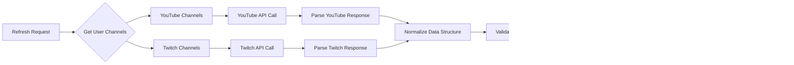

# Stream Aggregator API データフロー図

## システム全体データフロー

## ユーザーインタラクションフロー

### 1. 認証フロー

### 2. チャンネル管理フロー

### 3. 配信データ更新フロー（1分間隔）

## データ処理パイプライン

### 配信データ取得・統合パイプライン

### エラーハンドリングフロー

## リアルタイムデータ同期

### フロントエンド側ポーリング戦略

### データ鮮度管理

## データベース操作フロー

### CRUD操作パターン

## セキュリティデータフロー

### JWT トークン検証フロー

### データアクセス制御フロー

## パフォーマンス最適化フロー

### 並行処理によるAPI呼び出し最適化

---

**作成日**: 2025-08-07
**バージョン**: 1.0
**設計者**: Stream Aggregator開発チーム